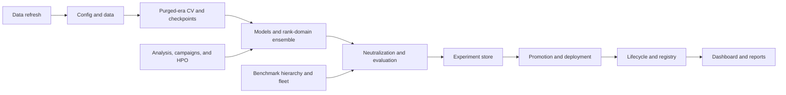

# Codebase Map: numer-AI-refactored (`nmr`)

> **Purpose:** The repository-level navigation contract for humans and AI agents.
>
> **This is a map, not a specification.** It routes a task to its controlling code, tests, and authoritative documentation. Detailed implementation contracts live in [`ARCHITECTURE.md`](ARCHITECTURE.md); official Numerai domain rules live in [`docs/01-canon/NUMERAI-CANON-DOCS-README.md`](docs/01-canon/NUMERAI-CANON-DOCS-README.md).

## Start Here

Choose the shortest path that matches the work:

| Situation | Read first | Then inspect |
| --- | --- | --- |
| Understand the repository | [`README.md`](README.md) | [`AGENTS.md`](AGENTS.md), this map |
| Change Python behavior | [`AGENTS.md`](AGENTS.md) | [`ARCHITECTURE.md`](ARCHITECTURE.md), owning module, nearest tests |
| Understand Numerai rules | [Canon index](docs/01-canon/NUMERAI-CANON-DOCS-README.md) | The specific canon page linked from its domain map |
| Change evaluation or a metric | [Evaluation bible](docs/06-evaluation/evaluation-suite-bible.md) | Canon [scoring reference](docs/01-canon/10-scoring-reference.md), `nmr/evaluation.py`, parity tests |
| Run or assess a model experiment | [`docs/02-strategy/model-lifecycle.md`](docs/02-strategy/model-lifecycle.md) | `nmr/runner.py`, `nmr/models.py`, `nmr/scorecard.py`, runner tests |
| Change deployment or promotion | Canon [Model Uploads](docs/01-canon/05-model-uploads.md) | Canon [Submissions](docs/01-canon/04-submissions.md), `nmr/deployment.py`, `nmr/submission.py`, `nmr/promote.py` |
| Change docs or navigation | [`AGENTS.md`](AGENTS.md) documentation rules | [`docs/DOCS_README.md`](docs/DOCS_README.md), relevant owner document, docs-hygiene tests |
| Contribute or verify | [`CONTRIBUTING.md`](CONTRIBUTING.md) | The narrowest applicable test command, then the final gate |

## Authority Layers

One fact has one owner. Links are navigation; they do not transfer ownership.

| Layer | Owner | Audience | Owns |
| --- | --- | --- | --- |
| Agent contract | [`AGENTS.md`](AGENTS.md) | AI agents | Non-negotiable rules, invariants, hazards, security, and execution safeguards |
| Human entrypoint | [`README.md`](README.md) | Developers and external readers | Product purpose, setup, quickstart, and high-level repository shape |
| Implementation contract | [`ARCHITECTURE.md`](ARCHITECTURE.md) | Engineers and agents | Pipeline topology, module responsibilities, formulas, schemas, registries, and current gaps |
| Contributor workflow | [`CONTRIBUTING.md`](CONTRIBUTING.md) | Contributors | Environment setup, TDD workflow, verification commands, and review expectations |
| Repository navigation | This file | Humans and agents | Routes between authorities, code, tests, workflows, and task recipes |
| Official domain truth | [`docs/01-canon/`](docs/01-canon/NUMERAI-CANON-DOCS-README.md) | Humans and agents | Numerai rules, concepts, scoring, data, submissions, staking, and API behavior |
| Repository evaluation truth | [`docs/06-evaluation/evaluation-suite-bible.md`](docs/06-evaluation/evaluation-suite-bible.md) | Researchers and engineers | How this repository judges models and defines evaluation slices |
| Research guidance | [`docs/02-strategy/`](docs/02-strategy/strategy-bible.md) and [`docs/04-research/`](docs/04-research/research-program.md) | Researchers | Heuristics, proposals, surveys, and reproducible research context; never protocol truth |
| Historical material | [`docs/99-archive/`](docs/99-archive/README.md) | Researchers needing provenance | Archived or superseded material; it cannot override active owners |

When sources disagree, use this order: executable code and tests for behavior, the named owner above for documentation, then current external/API configuration for round-specific Numerai facts. Record a behavior change in the owner document in the same change.

## Repository Shape

| Area | Role | Entry point |
| --- | --- | --- |
| `nmr/` | Tested business logic and public library boundary | [`nmr/runner.py`](nmr/runner.py) for end-to-end flow; [`nmr/__init__.py`](nmr/__init__.py) for public exports |
| `tests/` | Executable specification, parity, determinism, and integration coverage | `tests/test_<owning_area>.py`; begin with the nearest test and `tests/conftest.py` |
| Root `*.py` scripts | Thin control-plane CLIs | [`ARCHITECTURE.md`](ARCHITECTURE.md#o-control-plane-scripts-zero-business-logic) and the matching `nmr/` module |
| `configs/` | Typed experiment and benchmark inputs | [`configs/example.yaml`](configs/example.yaml), [`nmr/config.py`](nmr/config.py) |
| `experiments/` | Self-contained model families, runs, exports, and lineage records | [`docs/02-strategy/model-lifecycle.md`](docs/02-strategy/model-lifecycle.md) |
| `artifacts/` | Generated reports, caches, benchmark outputs, and receipts | [`AGENTS.md`](AGENTS.md#10-agent-execution--shell-safeguards) for hygiene and safety rules |
| `docs/` | Domain canon, strategy, research, references, notebooks, evaluation, and archive | [`docs/DOCS_README.md`](docs/DOCS_README.md) |
| `notebooks/` | Researcher control plane only; no business logic | [`AGENTS.md`](AGENTS.md#2-global-engineering-principles-mandatory) |
| `.kimi-code/skills/` | Research protocols for feature campaigns, HPO, meta-analysis, and verification | [`ARCHITECTURE.md`](ARCHITECTURE.md) |
| `.github/` | CI and repository-local agent configuration | [CI workflow](.github/workflows/ci.yml), [principal reviewer](.github/agents/principal-reviewer.agent.md), [documentation janitor](.github/agents/documentation-janitor.agent.md) |

## System Flow

The main path is deliberately linear; research and benchmark tools feed evidence
into it without becoming alternate lifecycle authorities.

`nmr/runner.py` owns the experiment path. `nmr/experiment_store.py` owns run and
export persistence, `nmr/lifecycle.py` owns export validity, and
`nmr/registry.py` owns cross-family comparison and the champion pointer. Root
scripts only parse arguments, wire these modules, and print results.

## Task Routing Matrix

The matrix names the narrowest controlling surface. Read the listed test before editing when one exists.

| Task | Controlling code | Tests to start with | Documentation owner |
| --- | --- | --- | --- |
| Config validation or seeds | [`nmr/config.py`](nmr/config.py) | [`tests/test_config.py`](tests/test_config.py) | [`ARCHITECTURE.md`](ARCHITECTURE.md), [`configs/example.yaml`](configs/example.yaml) |
| Data loading or feature sets | [`nmr/data.py`](nmr/data.py), [`nmr/features.py`](nmr/features.py) | `tests/test_data.py`, `tests/test_features.py` | Canon [Data](docs/01-canon/02-data.md), architecture sections B and P |
| Fold construction or leakage | [`nmr/splitter.py`](nmr/splitter.py) | `tests/test_splitter.py`, `tests/test_benchmark_purge.py` | Canon [Models](docs/01-canon/03-models.md), [`AGENTS.md`](AGENTS.md#4-leakage-is-a-correctness-bug) |
| Transforms, scoring, or neutralization | [`nmr/_transforms.py`](nmr/_transforms.py), [`nmr/evaluation.py`](nmr/evaluation.py), [`nmr/risk.py`](nmr/risk.py) | [`tests/test_parity.py`](tests/test_parity.py), [`tests/test_risk_parity.py`](tests/test_risk_parity.py) | Canon [Scoring reference](docs/01-canon/10-scoring-reference.md), evaluation bible |
| Model fitting or OOF | [`nmr/models.py`](nmr/models.py), [`nmr/_oof.py`](nmr/_oof.py) | `tests/test_models.py`, `tests/test_runner.py`, `tests/test_checkpointing.py` | [`ARCHITECTURE.md`](ARCHITECTURE.md) |
| Ensembling or weight learning | [`nmr/ensemble.py`](nmr/ensemble.py) | `tests/test_ensemble.py` | Canon [Models](docs/01-canon/03-models.md), evaluation bible |
| Scorecards, robustness, or payout | [`nmr/scorecard.py`](nmr/scorecard.py), [`nmr/robustness.py`](nmr/robustness.py), [`nmr/payout.py`](nmr/payout.py) | `tests/test_scorecard.py`, `tests/test_robustness.py`, `tests/test_payout.py` | Evaluation bible; canon [Scoring live](docs/01-canon/09-scoring-live.md) |
| Experiment lifecycle or persistence | [`nmr/paths.py`](nmr/paths.py), [`nmr/lifecycle.py`](nmr/lifecycle.py), [`nmr/experiment_store.py`](nmr/experiment_store.py) | `tests/test_experiment_layout.py`, `tests/test_lifecycle.py`, `tests/test_experiment_store.py` | [`docs/02-strategy/model-lifecycle.md`](docs/02-strategy/model-lifecycle.md), architecture sections X-Z |
| Registry or champion promotion | [`nmr/registry.py`](nmr/registry.py), [`nmr/promote.py`](nmr/promote.py) | `tests/test_registry.py`, `tests/test_promote.py` | [`AGENTS.md`](AGENTS.md), model lifecycle |
| Submission or deploy artifact | [`nmr/submission.py`](nmr/submission.py), [`nmr/deployment.py`](nmr/deployment.py) | `tests/test_submission.py`, `tests/test_deployment.py`, `tests/test_runner.py` | Canon [Submissions](docs/01-canon/04-submissions.md), [Model Uploads](docs/01-canon/05-model-uploads.md) |
| Benchmark hierarchy or fleet | [`nmr/benchmark.py`](nmr/benchmark.py), [`nmr/benchmark_fleet.py`](nmr/benchmark_fleet.py) | `tests/test_benchmark_*.py` | [`docs/06-evaluation/benchmark-line-in-the-sand.md`](docs/06-evaluation/benchmark-line-in-the-sand.md), architecture sections M and fleet |
| Campaigns or HPO | [`nmr/campaign.py`](nmr/campaign.py), [`nmr/research.py`](nmr/research.py), [`nmr/opt.py`](nmr/opt.py) | `tests/test_campaign.py`, `tests/test_opt.py`, `tests/test_research.py` | `.kimi-code/skills/`, [`docs/04-research/research-program.md`](docs/04-research/research-program.md) |
| Dashboard or reports | [`nmr/dashboard.py`](nmr/dashboard.py), [`dashboard_ui/`](dashboard_ui/) | `tests/test_dashboard.py`, `tests/test_dashboard_ui.py`, `tests/test_dashboard_service.py` | architecture section W; active [dashboard design](docs/superpowers/specs/2026-08-18-vanilla-dashboard-design.md) |
| Data refresh or hardware | [`nmr/refresh.py`](nmr/refresh.py), [`nmr/hardware.py`](nmr/hardware.py) | `tests/test_refresh.py`, `tests/test_hardware.py` | architecture sections U and refresh ledger |
| Public API exports | [`nmr/__init__.py`](nmr/__init__.py) | [`tests/test_package_api.py`](tests/test_package_api.py) | [`AGENTS.md`](AGENTS.md) |

Use the exact filename search when a test name in this table is absent in a checkout; the owning module and `ARCHITECTURE.md` remain authoritative.

## Traversal Recipes

### New agent or unfamiliar task

1. Read [`AGENTS.md`](AGENTS.md).
2. Read the relevant row in this map.
3. Open the owning module and its nearest test together.
4. Follow the module entry in [`ARCHITECTURE.md`](ARCHITECTURE.md).
5. Read the domain owner only when the behavior depends on Numerai rules.
6. Make the smallest test-backed change, then run the narrow check and final gates in [`CONTRIBUTING.md`](CONTRIBUTING.md).

### Metric or evaluation change

[Canon scoring reference](docs/01-canon/10-scoring-reference.md) -> [evaluation bible](docs/06-evaluation/evaluation-suite-bible.md) -> [`nmr/_transforms.py`](nmr/_transforms.py) / [`nmr/evaluation.py`](nmr/evaluation.py) -> [`tests/test_parity.py`](tests/test_parity.py) and [`tests/test_risk_parity.py`](tests/test_risk_parity.py) -> scorecard and determinism tests.

### Research-to-deployment change

[Canon data](docs/01-canon/02-data.md) -> [Canon models](docs/01-canon/03-models.md) -> [`docs/02-strategy/model-lifecycle.md`](docs/02-strategy/model-lifecycle.md) -> [`nmr/runner.py`](nmr/runner.py) -> [`nmr/registry.py`](nmr/registry.py) -> [`nmr/promote.py`](nmr/promote.py) -> [Canon Model Uploads](docs/01-canon/05-model-uploads.md) -> deployment and submission tests.

### Documentation change

1. Identify the fact's owner in the authority table.
2. Edit the owner, then add links from maps or guides as needed.
3. Do not restate formulas, schemas, or operational rules in a navigation document.
4. Run `tests/test_docs_hygiene.py` and inspect the changed links.
5. Update this map only when a route, owner, or task surface changes.

## Maintenance Rules

- Keep this file short enough to scan. Add routes, not copied specifications.
- Every maintained Markdown or notebook under `docs/` must be reachable from [`docs/DOCS_README.md`](docs/DOCS_README.md) or a linked local index. Archived raw source is intentionally excluded.
- Every `nmr/*.py` module and root control-plane script must remain represented in [`ARCHITECTURE.md`](ARCHITECTURE.md).
- New workflow-critical code should add or update a nearby test and one routing row here.
- New authoritative documents must declare their audience, scope, and owner, then be linked from the appropriate index.
- Generated artifacts are outputs, not sources. Never use them as documentation authority.
- Navigation checks belong in the test suite and CI; a map that is not checked will eventually become fiction.
