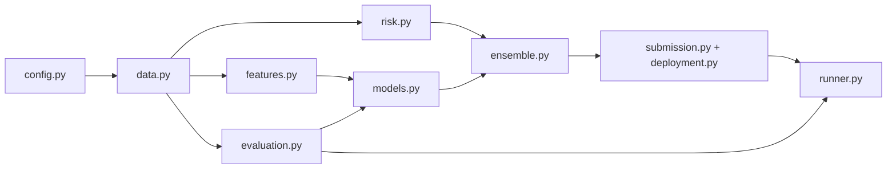

# Numerai V2 — Quantitative Research Framework

A lean, reproducible research framework for the Numerai Classic tournament.
Optimized for idea throughput: fast experimentation, deterministic pipelines,
and institution-grade submissions — without bloated abstractions.

> **Status note (2026-07-13):** This README reflects the *actual* state of the
> repository. The implementation is now substantially complete across the
> planned slices; only minor serialization hygiene (timing fields in
> cross-process determinism hashes) and documentation polish remain.

## North Star

Maximize tournament performance (MMC, CORR, FNC, Sharpe) while maximizing
research velocity. Every module must justify its existence by accelerating that.

## Current Status

| Slice | Scope | Status |
|------:|-------|--------|
| 0 | Foundation: package skeleton, typed config, determinism, test harness | ✅ Done |
| 1 | Data layer — `IngestionAgent` (Polars lazy ingestion) | ✅ Done |
| 2 | Validation & features — `PurgedEraSplitter` | ✅ Done |
| 3 | Evaluation oracle — dual-backend metrics + `numerai_tools` parity | ✅ Done |
| 4 | Risk — `NeutralizationEngine` (intercept-aware, era-cached) | ✅ Done |
| 5 | Modeling — `ModelOrchestrator` (LightGBM/XGBoost, anchor + CV, OOF) | ✅ Done |
| 6 | Ensembling & target stacking (rank-domain) | ✅ Done |
| 7 | Submission & deployment (`predict` builder, cloudpickle, provenance) | ✅ Done |
| 8 | Experiment runner & registry (deterministic promotion DAG) | ✅ Done |
| 9 | Research enablement (HPO sweeps, diagnostics) | ✅ Done |
| E6 | Benchmark harness — null/classical baselines + tutorial ingestion | ✅ Done |

What actually exists today: the full `nmr/` package pipeline from config to
submission, plus a real-data benchmark runner. See `nmr/` for the implementation
and `tests/` for coverage.

## Design Laws (non-negotiable)

1. **`nmr/` is the only tested boundary.** Notebooks and scripts are a thin
   control plane with zero business logic.
2. **Oracle parity.** Every custom metric must match `numerai_tools.scoring`
   in a parity test, or it is suspect. Fast custom path for research, official
   path for audit/CI.
3. **Determinism.** Config-driven, seeded, era-grouped. No hidden state.
4. **Leakage is a correctness bug**, never a tuning detail. Overlapping targets
   require era purge/embargo (8 eras for 20D, 16 for 60D).
5. **V1 (`../numer-AI/`) is read-only legacy.** Mine it for logic; never import it.

## Package Layout

```
numer-AI-refactored/
├─ nmr/                  # the framework package (tested boundary)
│  ├─ __init__.py
│  ├─ _transforms.py     # shared rank/gaussianize/power transforms
│  ├─ benchmark.py       # E6 benchmark harness and null/classical baselines
│  ├─ config.py          # ✅ typed YAML config, determinism, path resolution
│  ├─ data.py            # lazy Polars ingestion agent
│  ├─ deployment.py      # cloudpickle predict artifact + integrity manifest
│  ├─ ensemble.py        # rank-domain blending and weight learning
│  ├─ evaluation.py      # dual-backend CORR/MMC/FNC/BMC/CWMM metrics
│  ├─ inference.py       # bootstrap CI, AC-adjusted Sharpe, Deflated Sharpe
│  ├─ models.py          # LightGBM/XGBoost orchestrator (CV OOF + anchor)
│  ├─ payout.py          # payout proxy and downside diagnostics
│  ├─ registry.py        # atomic run registry with champion promotion
│  ├─ research.py        # HPO sweeps and neutralization frontier
│  ├─ risk.py            # per-era feature neutralization engine
│  ├─ robustness.py      # perturbation, horizon, and regime diagnostics
│  ├─ runner.py          # deterministic end-to-end experiment runner
│  ├─ scorecard.py       # MetricScorecard aggregator
│  └─ submission.py      # Numerai submission builder/validator
├─ configs/              # experiment configs (YAML)
│  └─ example.yaml
├─ tests/                # unit, parity, deployment, runner verification
├─ notebooks/            # researcher control plane (thin)
├─ artifacts/            # cache, run outputs, deployment bundles (git-ignored)
├─ data/                 # local Numerai v5.2 assets
└─ docs/                 # curated knowledge base — start at docs/README.md
```

## Architecture (target)


```mermaid
graph LR
  CFG[config.py] --> DATA[data.py]
  DATA --> FEAT[features.py]
  DATA --> EVAL[evaluation.py]
  FEAT --> MODELS[models.py]
  EVAL --> MODELS
  DATA --> RISK[risk.py]
  RISK --> ENS[ensemble.py]
  MODELS --> ENS
  ENS --> SUB[submission.py + deployment.py]
  SUB --> RUN[runner.py]
  EVAL --> RUN
```

## Setup

```powershell
# from the repo root, with the project virtualenv active
.\.venv\Scripts\python -m pip install -r requirements.txt
```

## Testing

The package is importable via `pythonpath = .` in `pytest.ini` (no install step).

```powershell
.\.venv\Scripts\python -m pytest -q
```

## Configuration

Experiments are parameterized by a single typed `ExperimentConfig`
(`nmr/config.py`). Nothing else reads YAML directly; invalid configs fail loudly
at load time. See `configs/example.yaml` for the full schema.

```python
from nmr import load_config, set_global_seeds

cfg = load_config("configs/example.yaml")
set_global_seeds(cfg.run.seed)
```

## Documentation

The curated Numerai knowledge base lives in `docs/`. Start at
[`docs/README.md`](docs/README.md) for the canonical laws, scoring definitions,
and a ranked reading path.
