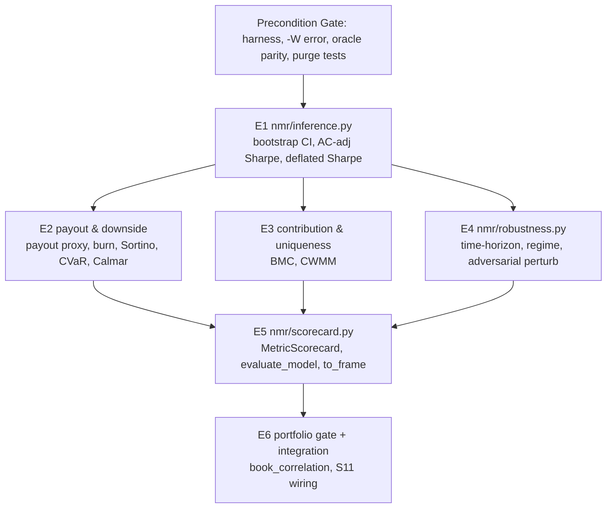

# The Evaluation Suite Bible (v2)

> **Status:** Specification of record. Locked.
> **Audience:** Any human engineer or LLM agent picking this up cold.
> **Scope:** *How we judge a Numerai model or strategy in this repository.* This is the single source of truth for the metric suite, its mathematics, its design decisions, and its build plan. If any other doc disagrees with this one about evaluation, this one wins.
>
> **Revision v2.1 (2026-06-21) — five hardening amendments** (red-team review, all verified): (1) adversarial perturbation is now a **discrete bin-shift / block-swap** — continuous Gaussian + re-quantize is a verified no-op on Int8 bins (§9); (2) the **DSR is computed on the unclipped** raw payout series, consistently (§4.3, §5.0); (3) **horizon-floor clamps** on bootstrap block length and Bartlett bandwidth (§4.1–4.2); (4) the **cross-trial Sharpe variance** must not fall back to the single-series analytic variance (§4.3); (5) the **non-vacuity guard is a hard `ValueError`** (§11 E3/E4).

This document is exhaustive by intent. It defines **what** we measure, **why** each metric exists, the **exact mathematics**, the **edge cases**, the **grading gates**, and the **ordered build slices** (E1–E6) that implement it. Nothing is left implicit. Read top to bottom once; thereafter use the Table of Contents.

---

## Table of Contents

1. [Philosophy and Mental Model](#1-philosophy-and-mental-model)
2. [Architecture and Dependency Graph](#2-architecture-and-dependency-graph)
3. [The Precondition Gate (not a metric)](#3-the-precondition-gate-not-a-metric)
4. [The Cross-Cutting Inference Layer](#4-the-cross-cutting-inference-layer)
5. [Tier 1 — Decision Metrics (vital signs)](#5-tier-1--decision-metrics-vital-signs)
6. [Tier 2 — Diagnostic & Robustness Metrics](#6-tier-2--diagnostic--robustness-metrics)
7. [Tier 3 — Capital-at-Risk Gates](#7-tier-3--capital-at-risk-gates)
8. [Three Resolved Design Pushbacks](#8-three-resolved-design-pushbacks)
9. [Adversarial Perturbation — Full Noise Design](#9-adversarial-perturbation--full-noise-design)
10. [Ground-Truth Data Facts](#10-ground-truth-data-facts)
11. [Build Slices E1–E6](#11-build-slices-e1e6)
12. [Reuse Map (existing `nmr/` modules)](#12-reuse-map-existing-nmr-modules)
13. [Grading Protocol and Probe Discipline](#13-grading-protocol-and-probe-discipline)
14. [Symbols and Glossary](#14-symbols-and-glossary)
15. [Standing Deferrals / Ledger](#15-standing-deferrals--ledger)

---

## 1) Philosophy and Mental Model

We do not "score a model" with one number and stop. A model passes through **three roles**, each answering a different question, plus a **cross-cutting inference layer** that attaches uncertainty to every claim, and a **precondition gate** that must be green before any number is trusted.

| Layer | Question it answers | Consequence of failing |
| --- | --- | --- |
| **Precondition Gate** | "Is the measurement itself trustworthy (leak-free, deterministic, oracle-faithful)?" | All downstream numbers are void. |
| **Tier 1 — Decision** | "How good is the alpha, and how confident are we?" | We **rank** on exactly one Tier-1 scalar. |
| **Tier 2 — Diagnostic** | "Is the alpha robust, stable across time/regime, and not a microstructure mirage?" | A model is **flagged**, investigated, but not auto-ranked on these. |
| **Tier 3 — Capital Gate** | "If we stake real NMR, what hidden risk does this add to the book?" | A model can be **vetoed** here even with great Tier-1. |
| **Inference (cross-cutting)** | "Could this result be luck, autocorrelation, or multiple-testing?" | Every Tier-1 scalar is **deflated / CI'd** before it is believed. |

### Three non-negotiable principles

1. **Rank on one scalar.** Humans cannot rank on 18 numbers. Everything in Tier 1 either *is* the rank scalar (the **Deflated Payout Proxy**) or can only **veto** it. Tiers 2 and 3 inform and gate; they do not silently re-rank.
2. **No point estimate without an error bar.** A Sharpe of 1.2 over 60 eras with positive autocorrelation is not the same as 1.2 over 600 i.i.d. eras. Every Tier-1 scalar carries a confidence interval and a multiple-testing haircut. This is the difference between a 72/100 framework and a world-class one.
3. **Per-era first, then aggregate.** Every metric is computed per era, then aggregated across eras. Flattening rows across eras is a category error in this tournament (overlapping, autocorrelated targets). This mirrors the canon in `../01-canon/scoring/00-definitions.md`.

---

## 2) Architecture and Dependency Graph

The suite is built as a small set of pure, composable Python modules under `nmr/`. The build order **is** the dependency order.

**Law:** `nmr/` is the only tested boundary. Each module is deterministic (seeded, era-grouped, no hidden state). Scoring math that has a Numerai oracle (`numerai_tools`) must match it (oracle parity). Leakage is a correctness bug, not a tuning choice.

---

## 3) The Precondition Gate (not a metric)

Before any metric is believed, the measurement apparatus must be proven sound. This is a **gate**, not a score. It is already enforced by the existing build (S0–S10) and must remain green for the evaluation suite.

- **TDD harness.** Full suite runs with `.\.venv\Scripts\python -m pytest -q -W error`. `-W error` promotes every warning (silent NaN coercions, dtype downcasts, deprecations) into a failure. A warning is a bug.
- **Oracle parity.** Any metric with a Numerai reference implementation (`numerai_tools.scoring.numerai_corr`, `.contribution`, `.neutralize`) must match it to floating tolerance (≤ 1e-6, typically 1e-8) on **real v5.2 data**, not synthetic toys.
- **Purge / embargo correctness.** Every train/validation/held-out seam respects the purge convention (8 eras for 20D, 16 eras for 60D). A zero-gap seam between overlapping targets is target leakage and must fail a test.
- **Determinism.** Same inputs + same seed ⇒ bit-identical outputs across **separate process invocations** (not just within one cached object). Determinism tests that reuse one in-memory instance are vacuous.
- **Non-vacuity.** Every parity/correctness test must also be shown to **fail** when the property is violated (e.g., inject NaN and confirm the guard raises). A test that passes on a no-op proves nothing.

> **Hard lesson (recorded):** Green suites hide bugs — vacuous parity, cached corruption, masked warnings, unpurged seams, single-instance determinism tests. Independent probing on real data is mandatory (see §13).

---

## 4) The Cross-Cutting Inference Layer

**Module:** `nmr/inference.py` (build slice **E1**).

This layer turns point estimates into *defensible* estimates. It is consumed by Tier 1 (mandatory) and by Tier 2 regime/horizon CIs. Three functions, all seeded and deterministic.

### 4.1 Block (circular) bootstrap confidence interval

Per-era series are autocorrelated (overlapping 20D/60D targets). An i.i.d. bootstrap would understate uncertainty by shuffling away that dependence. We use the **moving/circular block bootstrap**: resample contiguous blocks of eras so within-block autocorrelation is preserved.

Given a per-era series $x = (x_1, \dots, x_n)$, a statistic $\theta = g(x)$ (e.g., mean, Sharpe), block length $\ell$, and `n_boot` replicates:

1. Form circular blocks $B_i = (x_i, x_{i+1}, \dots, x_{i+\ell-1})$ indices mod $n$.
2. For each replicate $b$: draw $\lceil n/\ell \rceil$ blocks uniformly with replacement, concatenate, truncate to length $n$, compute $\theta^{*}_b = g(\cdot)$.
3. CI = empirical percentiles $[\,\theta^{*}_{(\alpha/2)},\ \theta^{*}_{(1-\alpha/2)}\,]$.

- **Row-resampling over an aligned matrix (hard API constraint).** Resampling is over the **era axis** of a 1-D *or* 2-D array (rows = eras). The same drawn block indices are applied to **every column together**, so multi-series, era-aligned statistics resample coherently. This is mandatory so a **conditional** statistic — e.g. the tail-conditional book correlation (§7.4) — can recompute its own mask **inside** `stat_fn` on each contiguous resampled replicate. Pre-slicing a non-contiguous conditional subset before bootstrapping is forbidden.

- **Block length — heuristic *then* a mandatory horizon-floor clamp.** Start from $\ell \approx n^{1/3}$ (rounded) as a *suggestion only*, then **clamp to the physical overlap floor**: $\ell \ge 5$ for **20D** targets, $\ell \ge 13$ for **60D** targets. The per-era series inherits its autocorrelation from target overlap (20D windows span ~4 eras, 60D windows span ~12 eras). A block shorter than the overlap slices through a single target's return window and *destroys* the dependence the bootstrap exists to preserve, understating the CI. **The floor always wins over the heuristic.** (At $n=574$ the bare heuristic gives $\ell\approx8$, which is silently too short for 60D — hence the clamp. The 8/16 purge convention may be used as an even more conservative floor.)
- **Seeded:** the same `seed` ⇒ the same draws ⇒ the same CI, across processes.
- **Signature:** `block_bootstrap_ci(data, stat_fn, *, block_len, n_boot, seed, alpha=0.05) -> (point, lo, hi)` where `data` is era-indexed 1-D or 2-D (rows = eras). `block_len` must be resolved through the horizon-floor clamp before use; the horizon of the target under test is a required input to that resolution.

### 4.2 Autocorrelation-adjusted Sharpe (Lo, 2002)

The naïve Sharpe $\widehat{SR} = \hat\mu / \hat\sigma$ (with $\hat\sigma$ using `ddof=0`, and $\widehat{SR}=0$ when $\hat\sigma=0$) **overstates** skill when the per-era series is positively autocorrelated, because overlapping targets smooth the series and understate its true variance. We deflate using a Newey–West / Bartlett correction:

$$
SR_{\text{adj}} = \frac{\widehat{SR}}{\sqrt{\,1 + 2\sum_{k=1}^{K}\left(1 - \dfrac{k}{K+1}\right)\rho_k\,}}
$$

where $\rho_k$ is the lag-$k$ autocorrelation of the per-era series and $K$ is the Bartlett bandwidth. As with the block length, the heuristic $K = \lfloor 4 (n/100)^{2/9} \rfloor$ is a *starting point only* and is then **clamped to the same horizon floor**: $K \ge 4$ for **20D**, $K \ge 12$ for **60D**, and to $[\,\cdot\,, n-1]$. The Bartlett weights $(1 - k/(K+1))$ guarantee the denominator stays positive (positive-semidefinite long-run variance). Truncating the autocovariance sum below the target's overlap length understates the long-run variance and **inflates** $SR_{\text{adj}}$ — the same failure mode as a too-short bootstrap block (at $n=574$ the bare heuristic gives $K\approx5$, too short for 60D).

- When $\sum_k \rho_k > 0$ (positive autocorrelation), the denominator $> 1$ ⇒ $SR_{\text{adj}} < \widehat{SR}$. **This direction is a hard gate.**
- **Signature:** `ac_adjusted_sharpe(series, *, bandwidth=None) -> float`. The target horizon is a required input to the bandwidth-floor resolution.

### 4.3 Deflated Sharpe Ratio (Bailey & López de Prado, 2014)

A Sharpe selected as the best of $N$ trials is upward-biased by multiple testing, and is distorted by non-normal returns. The **Deflated Sharpe Ratio (DSR)** is the probability the *true* Sharpe exceeds a benchmark $SR_0$, given track length, skew, kurtosis, and the number of trials:

$$
\text{DSR} = \Phi\!\left(
\frac{(\widehat{SR} - SR_0)\,\sqrt{n - 1}}
{\sqrt{\,1 - \gamma_3\,\widehat{SR} + \dfrac{\gamma_4 - 1}{4}\,\widehat{SR}^{\,2}\,}}
\right)
$$

with:

- $n$ = number of eras (observations).
- $\gamma_3$ = skewness, $\gamma_4$ = (non-excess) kurtosis of the per-era series.
- $\Phi$ = standard normal CDF, $Z^{-1}$ = its inverse (probit).
- $SR_0$ = expected maximum Sharpe **under the null** across $N$ independent trials:

$$
SR_0 = \sqrt{\widehat{\operatorname{Var}}(\widehat{SR}_{\text{trials}})}\;\Big[(1-\gamma_e)\,Z^{-1}\!\big(1 - \tfrac{1}{N}\big) + \gamma_e\,Z^{-1}\!\big(1 - \tfrac{1}{N e}\big)\Big]
$$

where $\gamma_e \approx 0.5772$ is the Euler–Mascheroni constant and $e$ is Euler's number.

- $\widehat{\operatorname{Var}}(\widehat{SR}_{\text{trials}})$ is the variance of the Sharpe estimates **across the $N$ trials** — the multiple-testing / hyperparameter-search dimension. It is **not** the sampling variance of a single Sharpe over time, and the single-series analytic estimator $\big(1 - \gamma_3\widehat{SR} + \tfrac{\gamma_4-1}{4}\widehat{SR}^2\big)/(n-1)$ **must never be substituted for it** — they are different estimands (cross-sectional vs temporal) and conflating them is a category error. Resolve it by exactly one of:
  1. **Empirical cross-trial variance** from the sweep/registry when the trial Sharpes are recorded (preferred).
  2. **Single isolated model, $N=1$:** there is no multiple testing — set $SR_0 = 0$, so DSR reduces to the Probabilistic Sharpe Ratio against the benchmark.
  3. **Known-but-unrecorded trials:** a conservative institutional default `trials_sr_var = 0.05`, or the historical variance from the baseline model registry.
  - *Directional note:* over-stating this variance raises $SR_0$ and **over-deflates** (false rejection); under-stating it lets overfits pass. The analytic-temporal fallback is wrong in either direction, which is why it is struck entirely.
- **Monotonicity (hard gate):** $SR_0$ increases in $N$, so DSR is **monotonically decreasing** in `n_trials`. More things you tried ⇒ higher bar to clear.
- **Signature:** `deflated_sharpe(sharpe, *, n_trials, n_obs, skew, kurt, trials_sr_var=None, sr0_benchmark=0.0) -> float`. When `n_trials == 1`, ignore `trials_sr_var` and force $SR_0=0$; when `n_trials > 1` and `trials_sr_var is None`, raise rather than silently inventing a temporal-variance fallback.

> **Why this layer is non-negotiable:** without it, a Sharpe of 1.3 found by trying 200 configs on 60 autocorrelated eras looks like genius and is actually noise. The inference layer is what makes the framework "Jane Street," not "Kaggle."

---

## 5) Tier 1 — Decision Metrics (vital signs)

Tier 1 is small on purpose. One scalar to rank; the rest can only veto. Every Tier-1 quantity is reported **with** its bootstrap CI (§4.1) and, where it is a Sharpe, its **AC-adjusted** form (§4.2). The headline rank scalar is **deflated** (§4.3).

### 5.0 THE rank scalar — Deflated Payout Proxy

This is the single number we sort models by. It is a per-era proxy of real tournament economics, aggregated, then deflated.

Per era $e$:

$$
\pi_e = \operatorname{clip}\!\big(\,\text{pf}\cdot(0.75\,\text{CORR}_e + 2.25\,\text{MMC}_e),\ -0.05,\ +0.05\,\big)
$$

- $\text{pf}$ = payout factor (default $1.0$; configurable to model real stake-threshold throttling, see `../01-canon/staking.md`).
- Weights $0.75 / 2.25$ and the $\pm 0.05$ clip match the current canonical payout (see `../README.md`).
- **Mean payout proxy** $\bar\pi = \tfrac{1}{n}\sum_e \pi_e$ is the raw scalar; the **reported rank scalar** is $\bar\pi$ wrapped by the inference layer: report $(\bar\pi,\ \text{CI}_{95\%}(\bar\pi),\ \text{DSR})$. **We rank on the deflated, CI-aware payout proxy.**
- **Clipped vs unclipped — a hard rule for the DSR.** The economic point estimates (mean payout $\bar\pi$, burn rate, CVaR, drawdown) use the **clipped** series $\pi_e$, because $\pm0.05$ is what you are actually paid. But the **Deflated Sharpe Ratio must be computed entirely on the *unclipped* raw series** $\pi_{\text{raw},e} = \text{pf}\cdot(0.75\,\text{CORR}_e + 2.25\,\text{MMC}_e)$ — its $\widehat{SR}$, $\gamma_3$, **and** $\gamma_4$ together, consistently from the same distribution. The clip masses probability at $\pm0.05$, truncating the tails and biasing sample kurtosis, which violates the continuity assumption underlying the Bailey–López de Prado framework and would make the rank scalar fluctuate erratically. **Do not** mix a clipped-series Sharpe with unclipped moments in the same DSR denominator — that combines moments from two different distributions and is its own error. Unclipped end-to-end for the DSR; clipped for the economic headline.
- **Edge cases:** degenerate predictions (constant) ⇒ $\text{CORR}_e=0$, $\text{MMC}_e=0$ ⇒ $\pi_e=0$. Empty/!=overlap eras are excluded and `n_eras` is surfaced.

### 5.1 CORR — Numerai rank correlation

Per era, per the canon (`../01-canon/scoring/01-correlation.md`): tie-kept rank the predictions to uniform $(0,1)$ via $(\operatorname{rankdata}-0.5)/n$, gaussianize with $\Phi^{-1}$, apply sign-preserving power $1.5$ ($\operatorname{sign}(x)\,|x|^{1.5}$), do the same sign-preserving power-1.5 to the **centered** target, then take Pearson correlation. Tails dominate by design.

- **Source of truth:** `nmr/_transforms.py` (`tie_kept_rank`, `gaussianize`, `power_1_5`) and `nmr/evaluation.py::per_era_corr`. Custom path must match `numerai_tools.scoring.numerai_corr` (oracle parity, proven on v5.2).
- **Report:** mean CORR + bootstrap CI.

### 5.2 MMC — Meta Model Contribution

Per era: gaussian-rank predictions and the meta model, orthogonalize predictions against the meta model, center the target, then MMC $= (\text{target} \cdot \text{neutral\_preds})/n$ (covariance, since mean $=0$). See `../01-canon/scoring/02-mmc-bmc.md`.

- **CRITICAL implementation fact:** for targets in $[0,1]$ the evaluation engine must use `live_target * 4.0` to land the covariance in the oracle's scale. This is encoded in `nmr/evaluation.py` and verified by oracle parity. Do not "simplify" it away.
- **Report:** mean MMC + bootstrap CI; **MMC Sharpe** (AC-adjusted) appears in Tier 2.

### 5.3 FNC — Feature-Neutral Correlation

CORR computed **after** neutralizing predictions to the feature set (`nmr/risk.py::neutralize`, then `per_era_corr`). Measures alpha that survives stripping linear feature exposure. Tail-light models with pure feature beta collapse here.

- **Report:** mean FNC. (No CI required for Tier-1 veto use, but available.)

### 5.4 AC-adjusted CORR Sharpe

$\widehat{SR}$ of the per-era CORR series, then deflated by autocorrelation (§4.2), reported with bootstrap CI. This is the risk-adjusted stability vital sign. **Must** be the AC-adjusted form — a naïve Sharpe on overlapping eras is inflated.

### 5.5 Tail risk — CVaR₅ / Max Drawdown

- **Max drawdown:** maximum peak-to-trough decline of the cumulative per-era payout-proxy (or CORR) path. Already in `MetricSummary.max_drawdown`.
- **CVaR₅ (Expected Shortfall):** mean of the worst 5% of per-era outcomes — the average of the left-tail beyond the 5th percentile. Captures depth of bad eras, not just their count.

### 5.6 Burn rate

$\text{burn} = \mathbb{P}(\pi_e < 0) = \tfrac{1}{n}\#\{e : \pi_e < 0\}$ — the fraction of eras that would burn stake. A high-mean, high-burn model is psychologically and economically worse than its mean suggests.

---

## 6) Tier 2 — Diagnostic & Robustness Metrics

Tier 2 explains *why* Tier 1 looks the way it does and whether it will survive contact with the future. These **flag**; they do not auto-rank.

### 6.1 Downside-shape statistics

- **MMC Sharpe** (AC-adjusted): risk-adjusted uniqueness.
- **Sortino:** $\hat\mu / \sigma_{\text{down}}$, where $\sigma_{\text{down}}$ uses only sub-target (negative) deviations. Rewards upside asymmetry.
- **Calmar:** mean return / |max drawdown|. Return per unit of worst pain.
- **std(CORR):** raw per-era volatility of skill.
- **Max consecutive burn streak** and **time-to-recovery:** longest run of consecutive negative-payout eras, and eras to recover a prior cumulative peak. These are the metrics that predict whether *you will pull your stake at the worst moment*.

### 6.2 Regime-conditioned mean CORR (with CI)

Partition eras by an **offline-computable** regime variable (e.g., realized target/feature volatility, or a market-volatility proxy available without future data). For each regime, report **mean CORR with a bootstrap CI** from §4.1.

- **Hard design rule:** report a **conditional mean with uncertainty**, NOT a thresholded "hit rate." A hit rate throws away magnitude and manufactures false precision on a small conditioning set. The CI *is* the honesty.
- Delegates entirely to E1 for the interval; no inline statistics in the robustness module.

### 6.3 Time-Horizon Stability (20D vs 60D)

Does the alpha persist across horizons, or is it short-horizon microstructure noise? Decided design (see §8, Pushback 2):

1. **Isolate horizon with same-name pairs.** Compare a target against *its own 60D counterpart* (e.g., `target_cyrusd_20` vs `target_cyrusd_60`), **never** a different name at 60D. Different names use different neutralization beds; same-name holds the bed fixed so the residual difference is horizon.
2. **Scale by a benchmark.** Report **relative divergence**: the model's 20-vs-60 decay measured against a *benchmark model's* decay on the **same** target pair. Plunging faster than the benchmark ⇒ overfit to short-horizon noise; tracking it ⇒ stable horizon-alpha. Absolute divergence in a vacuum is meaningless.
3. **De-bias the Sharpe.** 60D per-era series are more serially correlated; the 20-vs-60 Sharpe comparison **must** use the AC-adjusted Sharpe (§4.2), or apparent divergence is just an autocorrelation artifact.

### 6.4 Adversarial Feature Perturbation (rank stability)

Inject seeded **discrete** perturbations into the integer-bin features, re-score, and measure how much the prediction *ranking* moves. Full design in §9 (continuous Gaussian is a verified no-op on these bins). Tier-2 outputs:

- **Distortion-ceiling stability:** mean per-era Spearman between clean and independently bin-shifted predictions (worst-case / Lipschitz upper bound on fragility).
- **On-manifold stability:** the same, using block-swap (joint-distribution-respecting) perturbation.
- **Gap** = ceiling − manifold: how much measured fragility is an off-manifold artifact vs real.

---

## 7) Tier 3 — Capital-at-Risk Gates

Run only on finalists. These can **veto** a model that ranks well on Tier 1, because staking real NMR adds risk the rank scalar does not see.

### 7.1 Max Feature Exposure

Largest absolute per-era correlation between the prediction and any single feature (`nmr/research.py::feature_exposure_report`). A model whose alpha is one feature in disguise is a time bomb when that feature regime turns.

### 7.2 BMC — Benchmark Model Contribution

Contribution after orthogonalizing against the (stake-weighted, or highest-staked in diagnostics) **benchmark models** — via `numerai_tools.scoring.contribution` (**oracle parity required**, ≤ 1e-6). Answers: does this beat what Numerai's own benchmarks already provide?

- **Coverage:** computed only on eras where validation overlaps the benchmark-model eras; report `n_eras` of the overlap. (Train eras do **not** overlap; see §10.)

### 7.3 CWMM — Crowding With the Meta Model

Per-era correlation of the gaussian-rank-power-1.5 prediction against the **meta model** itself (not the target). High CWMM ⇒ you *are* the crowd; your MMC headroom is structurally small. Distinct from MMC (which neutralizes against the meta model); CWMM measures raw overlap.

- **Coverage:** validation ∩ meta-model eras; report `n_eras`.

### 7.4 Internal Portfolio Orthogonality (Book Correlation) — with tail conditioning

Does this candidate actually diversify our **existing staked book**, or is it a 0.95-correlated clone wearing a hat? Decided design (see §8, Pushback 3):

- Compute on the **per-era P&L / score time series** ($\text{CORR}_e$ or $\pi_e$) of candidate vs book — **not** cross-sectional prediction ranks (those measure signal redundancy, a different question).
- **$\rho_{\text{global}}$:** correlation of candidate vs book per-era scores over all eras.
- **$\rho_{\text{tail}}$:** correlation conditioned on the eras where the **book's own** per-era score is in its worst decile (~57 of 574 eras).
- **spread** $= \rho_{\text{tail}} - \rho_{\text{global}}$, reported **with a block-bootstrap CI** (§4.1) because the conditioning set is small.
- **Tail-conditional bootstrap — mandatory procedure (do not pre-slice).** The worst-decile eras are **non-contiguous** — scattered drawdown clusters across the 574-era horizon. Slicing them into an isolated ~57-era vector and block-bootstrapping *that* is **wrong**: it forces blocks across eras that were years apart (manufacturing fake serial dependence) and erases the real temporal clustering of drawdowns. The **only** correct procedure:
  1. Block-bootstrap the **full, contiguous, era-aligned joint series** of candidate **and** book *together* (circular blocks over all $n$ eras), so each replicate preserves true regime serial correlation.
  2. **Inside** the bootstrap's `stat_fn`, recompute the worst-decile threshold on the **resampled book path** for that replicate.
  3. Mask both resampled series to those indices and compute $\rho_{\text{tail}}$ (and the spread) on the masked subset.
  This lets the conditional mask vary naturally with the resampled path and propagates the uncertainty in *which* eras are in the tail. It requires E1's `block_bootstrap_ci` to resample **rows of an aligned matrix** (not a single 1-D vector) and to pass the resampled block to a caller-supplied `stat_fn` — a hard E1 API constraint (§4.1).
- A significantly **negative** spread is the tail-hedge signal: the candidate decouples exactly when the book bleeds. **This is a flagged diagnostic, not a hard threshold** — vetoing on $\rho_{\text{global}}$ alone would discard genuine crash-hedges.
- Also report `max` and `mean` pairwise cross-sectional prediction rank correlation for plain redundancy, clearly labeled as a *separate* quantity.

### 7.5 Pre-stake checklist (non-metric)

Before real capital: confirm seed/temporal reproducibility (§13), bounded max-burn streak and recovery (§6.1), and crowding/capacity sanity (CWMM, §7.3). This is a human sign-off, not an auto-gate.

---

## 8) Three Resolved Design Pushbacks

These three critiques were raised, evaluated with full rigor, and **all found true**. Their resolutions are now part of the spec. Recorded here so no future engineer re-litigates settled ground.

### Pushback 1 — The Copula Trap (adversarial perturbation) — **TRUE, refined**

Independent per-feature Gaussian injection samples from the product of the marginals $\prod_f \mathcal N(0,(\alpha\sigma_{\text{train},f})^2)$, discarding the copula that binds correlated feature blocks. For tightly coupled features the real mass sits on a diagonal; independent noise pushes mass off it, manufacturing **unphysical assets**. Re-quantizing to bins keeps you on the integer lattice but does **not** make a lattice point physically realizable, so the concern survives quantization.

**Refinement (correction to the correction):** off-manifold sensitivity is not automatically "wrong measurement." We deliberately keep **two modes** because they answer two questions:

- **Independent noise = distortion ceiling.** Worst-case / Lipschitz fragility — an honest *upper bound* on instability. The off-manifold exploration is the point here.
- **Block-structured (manifold) realism.** A continuous covariance-noise draw has the *same* quantization lock and also leaves the integer lattice, so the manifold mode is **discrete too**: a seeded **block swap** — with probability $\alpha$, replace a row's bin-subvector for a named block with the same block's subvector from another randomly chosen *real train row*. Every block-combination used is one that actually occurred, so it is **on-manifold by construction** while still discrete and copula-respecting.

Report **both** and their **gap**. The named blocks exist in the data (`intelligence, charisma, strength, dexterity, constitution, wisdom, agility, serenity, sunshine, rain, midnight, faith` — see §10). Implemented in E4 (§9).

### Pushback 2 — Horizon vs Neutralization-Bed confound — **TRUE, extended**

The 20D main target and a *differently-named* 60D target differ in **both** horizon **and** neutralization bed. A divergence cannot be attributed to horizon decay — it could be a structural factor exposure that one target hedges and the other does not.

**Resolution, stronger than the original fix:** the data ships every target name at **both** horizons (`target_cyrusd_20` *and* `target_cyrusd_60`, etc., §10). So we kill the confound **at the source** by comparing **same-name** pairs, then add **benchmark-relative** divergence for scale, then force the **AC-adjusted** Sharpe to remove the 60D autocorrelation artifact. Encoded in Tier 2 §6.3.

### Pushback 3 — Linear vs Tail Orthogonality — **TRUE (strongest)**

Global mean rank correlation is a bulk statistic dominated by the median regime. A candidate 0.9-correlated on average but **decoupled during the book's worst eras** is a tail hedge whose entire value is invisible to the average. A flat global-correlation veto destroys that value.

**Resolution + precision fix:** compute the tail correlation on the **per-era P&L time series**, conditioned on the book's worst-decile eras, with a bootstrap CI (small-$n$), reported as $(\rho_{\text{global}}, \rho_{\text{tail}}, \text{spread})$ — a flagged diagnostic, never a hard threshold. The original phrasing conflated cross-sectional prediction ranks with the time series of per-era performance; only the latter is portfolio-relevant. Encoded in Tier 3 §7.4.

---

## 9) Adversarial Perturbation — Full Noise Design

**Module:** `nmr/robustness.py` (E4). **Goal:** quantify how stable a model's *ranking* is under small input noise, leak-free and reproducibly.

### 9.1 Why the noise is discrete, not Gaussian (a verified landmine)

The v5.2 features are `Int8` bins in $\{0,1,2,3,4\}$ (verified, §10). A continuous design — add $\epsilon_f \sim \mathcal N(0,(\alpha\sigma_{\text{train},f})^2)$ then re-quantize — is a **near-total no-op** and must not be used. For a full-range feature $\sigma_{\text{train},f}\approx1.41$; at $\alpha=0.1$ the noise SD is $\approx0.14$, so $P(|\epsilon|>0.5)=P(|Z|>3.55)\approx0.0004$. **~99.96% of perturbed values round straight back to the original bin**, and the engine reports a false rank stability of $1.0$ after an expensive inference loop. (Tree models make this worse: their splits sit on bin boundaries $\approx x.5$, so a sub-boundary nudge changes no split even *without* re-quantization.)

**The intensity $\alpha \in [0.1, 0.25]$ is therefore a per-feature *perturbation probability*, not a noise-SD multiplier.**

- **Rejected — continuous Gaussian + re-quantize.** Erased by the integer lattice (above).
- **Rejected — OOS-variance scaling.** Calibrating any noise magnitude from the out-of-sample set leaks the evaluation distribution and is non-reproducible.
- **Chosen — discrete stochastic bin shift.** Deterministic, seeded, leak-free, and — critically — the noise field depends only on `(data_version, seed)`, **independent of the model under test**, so it is comparable across models and runs.

### 9.2 Two modes (from Pushback 1)

| Mode | Noise law (discrete) | Interpretation |
| --- | --- | --- |
| **Independent (ceiling)** | each feature is perturbed with probability $\alpha$; if perturbed it shifts by exactly $+1$ or $-1$ bin (symmetric Bernoulli), clamped to $[0,4]$ | Worst-case Lipschitz fragility (upper bound); can create off-manifold block-combinations. |
| **Block (manifold)** | with probability $\alpha$, a named block's bin-subvector for a row is **swapped** for the same block's subvector from another random *real train row* | Realistic, joint-distribution-respecting; on-manifold by construction. |

### 9.3 Procedure

1. Draw the seeded perturbation field from `(data_version, seed)` only — independent of the model. For the manifold mode, donor rows are sampled from **train**.
2. Apply the discrete shift (independent mode) or block swap (manifold mode). All values remain valid integer bins in $[0,4]$; no re-quantization step exists.
3. Predict on clean and perturbed inputs.
4. **Per-era rank stability** = Spearman correlation between clean and perturbed predictions for that era; aggregate by mean over eras. Output $\in [-1, 1]$.
5. Report independent-mode stability, block-mode stability, and the **gap** (ceiling − manifold = how much measured fragility is an off-manifold artifact).

### 9.4 Gates (E4)

- **Effective perturbation (anti-no-op gate):** assert that a non-trivial fraction of feature cells actually changed (≈ $\alpha$ in the independent mode); a measured stability of exactly $1.0$ with $\alpha>0$ is an automatic **Red**.
- **Determinism:** same seed ⇒ identical perturbation field ⇒ identical stability, across processes.
- **Model-independence of the field:** the perturbation depends only on `(data_version, seed)`, provably not on the model (probe with two different models, assert the identical perturbed tensor).
- **Leak-free:** donor rows and any statistics come from **train** only; assert no validation/live value touches the field.
- **Range:** stability $\in [-1,1]$; uses a **real** auxiliary target where a target is needed, not a synthetic stub.

---

## 10) Ground-Truth Data Facts

Verified against `../../data/v5.2/features.json` and the v5.2 parquet on 2026-06-21. Do not re-derive from memory; trust these.

- **Feature sets / blocks** (`feature_sets` keys): `small, medium, all, v2_equivalent_features, v3_equivalent_features, fncv3_features`, plus the named structural blocks used for the block-swap perturbation: `intelligence, charisma, strength, dexterity, constitution, wisdom, agility, serenity, sunshine, rain, midnight, faith`.
- **Feature encoding (verified):** features are `Int8` bins in $\{0,1,2,3,4\}$; full-range features have $\sigma\approx1.41$, many are near-constant. This discreteness is *why* perturbation must be a discrete bin shift, not continuous Gaussian (§9.1).
- **Targets:** every name ships in **both** horizons — `target_{agnes, alpha, bravo, caroline, charlie, claudia, cyrusd, delta, echo, ender, jasper, jeremy, ralph, rowan, sam, teager2b, tyler, victor, waldo, xerxes}_{20,60}`, plus the canonical alias `target`. **This is what makes same-name horizon pairs (§6.3) possible.**
- **Eras:** dtype `String`, values `"0001" .. "0574"` (574 eras). Train, validation, live splits in `data/v5.2/`.
- **Live target:** `live.parquet` carries an **all-null** target column (the future is unknown). Never score on it.
- **Coverage overlaps:** validation eras overlap the `meta_model.parquet` / `*_benchmark_models.parquet` eras; **train eras do not.** Therefore BMC/CWMM (§7.2–7.3) are computable only on the validation∩meta/benchmark intersection — always report `n_eras` of that overlap.
- **Purge convention:** 8 eras (20D) / 16 eras (60D) for walk-forward seams; 4/16 is the theoretical minimum (see `../README.md` §3).

---

## 11) Build Slices E1–E6

Same workflow as the S0–S10 build: the spec is fixed here, an engineer implements one slice, then it is graded Green / Yellow / Red with **independent probes** (§13). Order is the dependency order from §2.

### E1 — Inference Core *(blocks E2, E3, E4)*

- **Files:** `nmr/inference.py`, `tests/test_inference.py`.
- **Surface:** `era_series_stats(series)`; `block_bootstrap_ci(series, stat_fn, *, block_len, n_boot, seed, alpha=0.05)`; `ac_adjusted_sharpe(series, *, bandwidth=None)`; `deflated_sharpe(sharpe, *, n_trials, n_obs, skew, kurt, trials_sr_var=None, sr0_benchmark=0.0)`.
- **Gates (hardest first):**
  1. **Bootstrap determinism** — same seed ⇒ identical CI across two process invocations.
  2. **AC direction** — `ac_adjusted_sharpe < naive Sharpe` on a synthetic AR(1) series with $\rho>0$.
  3. **Deflation monotonicity** — `deflated_sharpe` strictly decreasing in `n_trials`.
  4. **CI coverage sanity** — on i.i.d. synthetic with known mean, the 95% CI covers the truth ≈ 95% of the time.

### E2 — Payout & Downside *(needs E1)*

- **Files:** `nmr/payout.py` (or methods on `EvaluationEngine`) + tests.
- **Surface:** per-era + mean **payout proxy** $\pi_e$ (pf configurable), **burn rate**, **Sortino**, **CVaR₅**, **Calmar**, **MMC Sharpe** (AC-adjusted), **max consecutive burn streak**, **time-to-recovery**.
- **Gates:** payout matches manual clip arithmetic on a hand-built series; downside stats correct on a constructed asymmetric series; degenerate/constant predictions ⇒ all-zero metrics, no NaN under `-W error`.

### E3 — Contribution & Uniqueness *(needs E1; parallel with E2)*

- **Files:** extend `nmr/evaluation.py` + tests.
- **Surface:** **BMC** via `numerai_tools.scoring.contribution` against benchmark-model series; **CWMM** = per-era corr of gaussian-rank-power-1.5 prediction vs `meta_model`.
- **Gates (hardest):** **BMC oracle parity** ≤ 1e-6 on real v5.2; CWMM matches the §7.3 definition; **coverage correctness** — loops run only over the validation∩meta/benchmark overlap, `n_eras` surfaced. The non-vacuity guard is a **hard runtime `raise`, not a log line**: if the resolved overlap has fewer than `MIN_OVERLAP_ERAS` eras (default 20), `raise ValueError(f"Non-vacuity violation: intersection yielded only {len(overlap_eras)} eras; minimum required {MIN_OVERLAP_ERAS}.")`. This is distinct from — and in addition to — the *test-coverage* non-vacuity discipline (the S3 lesson: a test must be shown to exercise real, non-empty data and to fail when the property is violated).

### E4 — Robustness Diagnostics *(needs E1)*

- **Files:** `nmr/robustness.py` + tests.
- **Surface:** `time_horizon_stability(...)` (§6.3: same-name 20/60, benchmark-relative, AC-adjusted); `regime_conditioned_corr(...)` (§6.2: per-regime mean CORR + CI via E1, **no** threshold); `adversarial_perturbation(...)` (§9: two-mode **discrete bin-shift / block-swap** perturbation, per-era rank stability + gap).
- **Gates (hardest):** the **anti-no-op gate** (§9.4 — a measured stability of exactly $1.0$ at $\alpha>0$ is automatic Red); perturbation **determinism**; **noise-field model-independence** (probe two models, identical perturbed tensor); rank stability $\in[-1,1]$; time-horizon uses the **real** aux target; regime CIs **delegate** to E1 (grep for inline stats ⇒ Red). Any era-intersection step carries the same hard `ValueError` non-vacuity guard as E3.

### E5 — Scorecard Aggregator *(needs E1–E4)*

- **Files:** `nmr/scorecard.py` + tests.
- **Surface:** `MetricScorecard` (structured Tier-1 / Tier-2 / Tier-3 fields + the single deflated rank scalar); `evaluate_model(predictions, *, meta_model, benchmarks, features, targets, n_trials, seed) -> MetricScorecard`; `to_frame()` → one tidy leaderboard row.
- **Gates:** end-to-end **determinism**; rank-scalar composition correct; **zero new math** — pure delegation to E1–E4 + `evaluation` (any inline statistic ⇒ Red); `coverage` / `n_eras` surfaced per metric.

### E6 — Portfolio Gate + Integration *(needs E5)*

- **Files:** `nmr/scorecard.py` (`book_correlation`) + integration into the S11 `BenchmarkSuite`, optionally `ExperimentRunner` / `RunRegistry` (scorecard into `run.json`).
- **Surface:** `book_correlation(candidate_oof, book_oofs, *, primary_book_scores, seed)` → $(\rho_{\text{global}}, \rho_{\text{tail}}, \text{spread})$ with CI (§7.4), plus labeled cross-sectional redundancy `max`/`mean`; every benchmark baseline emits the full scorecard.
- **Gates (hardest):** **null baselines floor on every metric** including the new ones (constant-0.5, uniform-random, gaussian-random ⇒ CORR≈0, payout≈0, FNC≈0, well-defined rank stability); **tail-conditional bootstrap correctness** — the worst-decile mask is recomputed *inside* `stat_fn` on the contiguous resampled joint series, never pre-sliced (§7.4); benchmark ladder emits Tier-1 + Tier-2 for all; end-to-end determinism.

---

## 12) Reuse Map (existing `nmr/` modules)

Do **not** re-implement what already exists and is oracle-proven.

| Need | Use | Notes |
| --- | --- | --- |
| Per-era CORR, MMC, FNC, summary stats | `nmr/evaluation.py` (`per_era_corr`, MMC, FNC, `summarize`, `MetricSummary`) | custom + official parity; **MMC needs `live_target*4` for [0,1] targets** |
| Neutralization | `nmr/risk.py` (`NeutralizationEngine.neutralize`) | per-era, intercept-aware, parity ≤ 1e-8 vs `numerai_tools.neutralize` |
| Feature exposure | `nmr/research.py` (`feature_exposure_report`) | reuse for Tier-3 §7.1 |
| Rank / gaussianize / power-1.5 geometry | `nmr/_transforms.py` (`tie_kept_rank`, `gaussianize`, `power_1_5`, `rank_gaussianize`) | **single source** of rank geometry; do not fork |
| Contribution oracle (BMC) | `numerai_tools.scoring.contribution` | parity target for E3 |
| Splits / purge | `nmr/splitter.py` (`PurgedEraSplitter`, `Fold`) | for any held-out robustness measurement |
| Ensembling / rank-blend | `nmr/ensemble.py` (`Ensembler`) | rank-domain blending |

---

## 13) Grading Protocol and Probe Discipline

Every slice is graded with the same discipline that exposed real bugs in S7–S10.

1. **Full suite under `-W error`:** `.\.venv\Scripts\python -m pytest -q -W error`. Any warning fails.
2. **Independent probe on real data:** write a throwaway script to `artifacts/_probe.py` (gitignored), run it, then delete it:
   - `$env:PYTHONPATH="."; .\.venv\Scripts\python artifacts\_probe.py`
   - `Remove-Item artifacts\_probe.py`
3. **Never trust an implementer's summary.** Re-derive the claimed property independently (oracle parity, determinism across processes, leak-free seams, non-vacuity).
4. **Grade Green / Yellow / Red:**
   - **Green:** all gates pass, probes confirm, no deferrals that affect correctness.
   - **Yellow:** works but carries a logged, non-correctness deferral.
   - **Red:** a gate fails or a probe contradicts the summary. Fix before proceeding.
5. **Hardest-graded properties across the whole build:** bootstrap & perturbation determinism, BMC oracle parity, regime/coverage non-vacuity, and **null-baseline flooring** on every metric.

> **Recorded lessons:** vacuous parity tests, cached-object corruption, masked warnings, unpurged seams, and single-instance determinism tests have *all* produced false-green suites in this repo. Probe independently, every time.

---

## 14) Symbols and Glossary

| Symbol / term | Meaning |
| --- | --- |
| $e$, $n$ | an era; number of eras |
| $\text{CORR}_e$ | Numerai rank correlation in era $e$ |
| $\text{MMC}_e$ | meta-model contribution in era $e$ |
| $\pi_e$ | per-era payout proxy $\operatorname{clip}(\text{pf}(0.75\,\text{CORR}_e + 2.25\,\text{MMC}_e),\pm0.05)$ |
| pf | payout factor, $\min(1, \text{threshold}/\text{total\_at\_risk})$; default 1.0 |
| $\widehat{SR}$ | naïve Sharpe $\hat\mu/\hat\sigma$ (ddof=0; 0 if $\hat\sigma=0$) |
| $SR_{\text{adj}}$ | autocorrelation-adjusted Sharpe (Lo 2002) |
| DSR | Deflated Sharpe Ratio (Bailey–López de Prado 2014) |
| $\rho_k$ | lag-$k$ autocorrelation of a per-era series |
| $K$ | Newey–West / Bartlett bandwidth |
| $\sigma_{\text{train},f}$ | train-set standard deviation of feature $f$ |
| $\Sigma_g$ | Ledoit–Wolf shrunk train covariance of feature block $g$ |
| $\alpha$ | perturbation intensity, $\in[0.1,0.25]$ |
| $\rho_{\text{global}}$, $\rho_{\text{tail}}$ | book correlation overall vs in the book's worst-decile eras |
| CVaR₅ | expected shortfall: mean of the worst 5% of per-era outcomes |
| FNC | feature-neutral correlation |
| BMC / CWMM | benchmark-model contribution / crowding-with-meta-model |
| Oracle | `numerai_tools` reference implementation; parity required |
| Distortion ceiling | the independent-noise (worst-case) perturbation stability |

---

## 15) Standing Deferrals / Ledger

Logged, non-blocking. Revisit deliberately, not by accident.

- **Code fingerprint is coarse** (hashes all `nmr/*.py`); fine-grained per-symbol fingerprinting deferred.
- **Ensemble weights** are learned in-sample on train OOF then scored on the purged held-out (S9); nested-CV weighting is a deferred feature.
- **Regime variable choice** (§6.2) must be offline-computable; the exact proxy (target-vol vs feature-vol vs market-vol) is to be fixed in E4 and recorded here once chosen.
- **Block length $\ell$ and bandwidth $K$** (§4.1–4.2) are now **clamped to horizon floors** (5/13 and 4/12 for 20D/60D); finer per-target tuning above the floor is deferred.
- **S11 benchmark ladder** (null/trivial/linear/tree baselines) is specced and couples to E6 (every baseline emits a scorecard); build it alongside E5/E6.

---

*End of bible. If you changed a metric, change it here first, then in code. This file is the light in the dark.*
